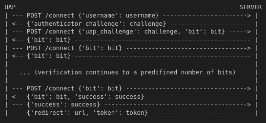

# Protoclo SIO-P2-E34
Este protocolo de autenticação foi desenvolvido tendo em conta os protocolos desafio-resposta com chave secreta partilhada.
O esquema de atuação é o seguinte (os endpoints utilizados são os presentes na app_auth, que é enviado à uap aquando a tentativa de autenticação):

Por fim a uap envia um pedido de REDIRECT url/?token={{token}} para o browser.

Ora como se pode tirar do esquema anterior, este protocolo funciona como o descrito no enunciado, enviado o minimo de informação possível, 1 bit, e recebendo também o mínimo de informação possível para verificar ambas as partes atuantes no protocolo.

Os desafios são gerados aleatoriamente, não sendo possível serem previstos ou calculados.

A stream de bits é obtida através da respostas calculadas tendo em contas os desafios. As respostas, calculadas num processo inspirado no MS-CHAP-V2, são transformadas numa stream de 512 bits, primeiramente, e de seguida são selecionados 256 bits começando num bit M até M+255. Este M é um número pseudo-aleatório, entre 0 e 255, obtido através do username que se pretende autenticar.

São depois enviados K bits. K é definido pelo servidor, nunca menos de 20, para evitar que autenticações sejam feitas apenas após o envio de 1 bit, e nunca mais de 40, pois caso a uap esteja conectada a um rogue server, não seja enviada demasiada informação que possa vir a comprometer as credenciais utilizador.

Após ambas as partes verificarem os bits com sucesso, é enviado um outro bit para comunicar o sucesso do processo de autenticação. Se em ambos os casos a verificação não falhou, o servidor envia um endereço e um token à UAP. A UAP vai então redirecionar a sua sessão no browser para o endereço recebido, enviando o token na query. O browser vai então receber um cookie de sessão e vai ser redirecionado para a página inicial (no caso da aplicação desenvolvida, pode ser diferente noutros casos)
