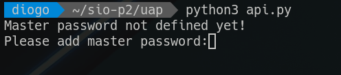
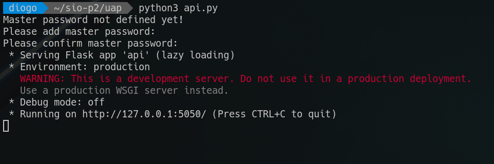
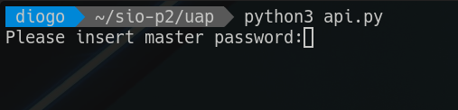
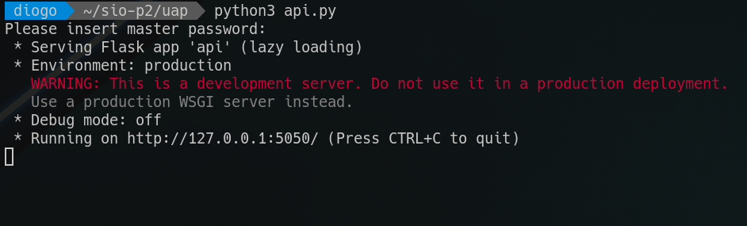
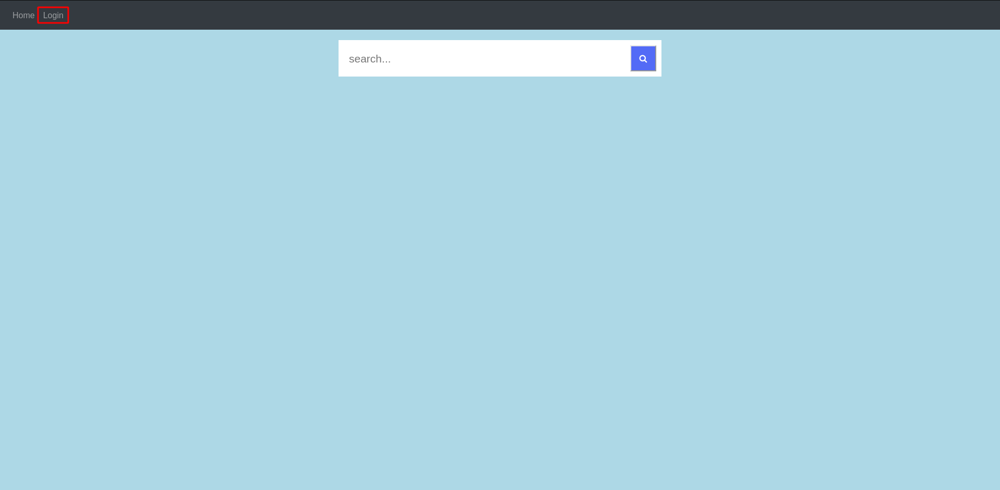
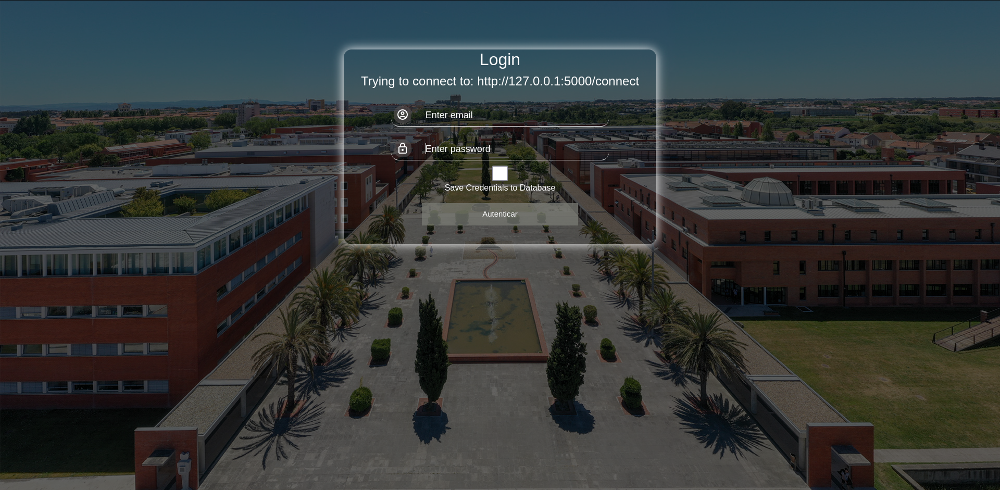
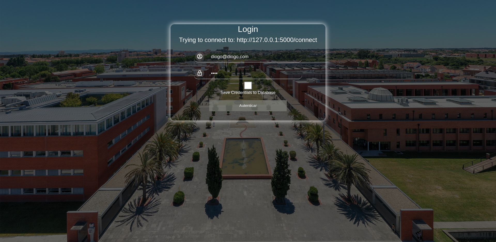
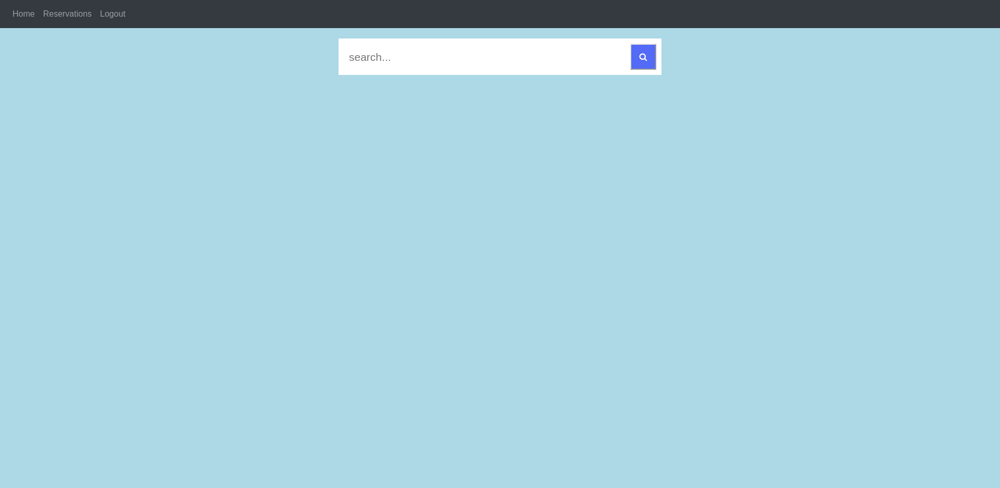

# Como funciona
## Credenciais na base de dados do servidor
*email*: diogo@diogo.com
*password*: 1234

*email*: admin@admin.com
*password*: 1234

## Inciar a UAP:
- Se for a primeira vez que é executada

- Se já tiver sido executada antes

## Tentar fazer login na webapp
- Começar processo
    
- Se não houverem credenciais guardadas na base de dados
    
- Se houverem credenciais na base de dados
    
- Salvar credenciais na base de dados, quer já haja ou não crendenciais associadas a esse endereço guardadas
    
- Resultado
    
